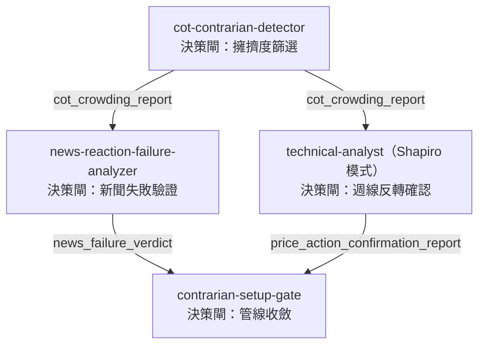

# 2.5 Shapiro：站在人群的對面

## 場景

週五午後三點半，美東時間，CFTC 準時公布最新一期 Commitment of Traders 報告——內容是上週二收盤時的建倉快照，發布當下就已經遲到三天。`shapiro-contrarian.yaml` 就等在這個時間點後面：`cadence: weekly`，`estimated_minutes: 60`，`difficulty: advanced`，`api_profile: fmp-required`，`target_users` 只寫了一種人——`futures-contrarian-trader`。前面四節走的都是同一片美股池子，用不同的偵查邏輯篩同一批候選；這一節連游泳池都換了：`cot-contrarian-detector` 篩的是約六十五個 CFTC 期貨市場的投機部位擁擠度——指數、利率、外匯、金屬、能源、加密貨幣，股票完全不在守備範圍。`swing-opportunity-daily` 天天跑；這條線一週只跑一次，因為 COT 資料本身一週只更新一次，跑得再勤也擠不出更多資訊。

## 方法論

這套逆勢邏輯出自 Jack D. Schwager 的《Unknown Market Wizards》（2020）第二章〈Jason Shapiro: The Contrarian〉——`shapiro-methodology.md` 只認這一個出處，外加 Shapiro 本人經營的 crowdedmarketreport.com 作為公開方法論與市場評論的補充來源，其餘生平一概不腦補。核心觀察很單純：真正殺死一個趨勢的，不是新買盤消失，是最後一個想追進場的人已經追完了——趨勢跟隨者只有在一個趨勢跑得夠遠、足以說服他們「這是真的」之後，才會全倉壓上，所以大額投機者（避險基金、CTA、動能基金）往往在趨勢**衰竭**時倉位最重，而不是在趨勢**起漲**時。文件特別點名要放空的是「投機者」，不是「商業避險者」——後者為了自家生意的結構性理由買賣，倉位反映的是供應鏈經濟學，不是群眾心理；只有投機者的部位，才真正是那群「群眾」。

那為什麼擁擠度不能自己構成訊號，非要疊上新聞驗證跟價格行為確認不可？因為擁擠可以拖很久——一個市場停在極端擁擠的狀態可能長達數月，光靠 COT 指數判斷「現在」該進場，時機根本抓不準。COT Index 的算法是 `(current_net - window_min) / (window_max - window_min) * 100`，`current_net` 是最新一週投機者淨部位（非商業多單減空單），拿它跟回溯窗格裡的最大最小值比——100 代表現在是窗格裡最淨多的一週，0 代表最淨空的一週，50 代表落在區間中點。主要窗格是 156 週（約三年），另外算一組 26 週（約半年）的窗格當情境參考，用來判斷擁擠是新鮮的還是已經開始退燒的；門檻是對稱的 90 分以上判 `CROWDED_LONG`，10 分以下判 `CROWDED_SHORT`，90、10 兩個邊界值本身都算數——這是收在「明確極端」這一端的保守門檻，放寬到 80/20 大約會讓篩出的市場數量翻倍，但誤判率也跟著上升。窗格內歷史不足，或者整個窗格裡淨部位從沒變過（最大值等於最小值），指數回傳的是 `None`，不是 0 也不是 50——避免把「沒資料」誤讀成「中性」。

COT Index 極端值本身還要看「有多少人」撐著它。`shapiro-methodology.md` 特別提醒：兩個市場都能算出 95 分的擁擠度，一個可能是 10 個大額投機者撐出來的極端，另一個是 200 個——後者的群眾更廣、也更耐撐。`screen_cot_crowding.py` 因此把交易人數（`tradersNoncommLongAll`／`tradersNoncommShortAll`）跟未平倉量一起附進報告，避免只看單一分數就下判斷；`cot-index-calculation.md` 也點出這份資料只採用 CFTC 的 legacy report（非商業／商業／非申報三類），不用拆得更細的 disaggregated report——因為後者只涵蓋實體商品期貨，指數、利率、外匯這些金融期貨反而沒有，跟 Shapiro 原本鎖定投機大戶的框架對不上。

**原著 vs 實作。** `shapiro-methodology.md` 自己的五步表——擁擠偵測、新聞失敗、價格行為確認、進場、出場——只把第一步標成「已自動化」，第二步以後全部寫著「No，Claude 用 WebSearch／看圖／`position-sizer`」。但這張表其實已經跟不上這個 repo 後來長出來的樣子：`news-reaction-failure-analyzer` 的 `SKILL.md` 明講自己實作的正是「Shapiro 流程的第二步」，用的是一套經 Monte Carlo 驗證過的統計檢定，不是人工讀新聞——第二步早就不是純手動了，只是承載這句話的文件沒有跟著更新。

## 機制

四步管線的第一棒，`cot-contrarian-detector` 跑 `screen_cot_crowding.py`——`--core` 抓 23 個具代表性的流動市場，不給參數則掃完整套約 65 個市場，逐一分類 `CROWDED_LONG`／`CROWDED_SHORT`／`NEUTRAL`，寫進 `cot_crowding_report`；歷史不夠算指數的市場不會被靜靜丟掉，會連同原因（例如「40/156 週資料不足」）列進 `skipped`。

第 2 步 `news-reaction-failure-analyzer` 跟第 3 步 `technical-analyst`（Shapiro 模式）不是接力棒，兩者都直接吃第 1 步的 `cot_crowding_report`，各自獨立跑——`gate-decision-table.md` 甚至專門留了一條分支處理「價格行為先於新聞判定跑完」的情況，不視為錯誤用法。第 2 步要驗證的是：擁擠方向本該受益的新聞出來了，價格卻沒有照劇本反應。早期設計曾經用「反應事件不到一半就判定失敗」這種比例規則——但在純雜訊底下，單一事件約有 69% 機率不會如預期反應，這條比例規則會在隨機雜訊裡誤判成立 48% 到 83% 之間，統計上毫無意義。現在的算法改用 `drift_stat = sqrt(n) * mean(方向調整後的 zscore_3d)`（`n` 是事件群集數，3 個交易日內重疊的事件先合併成一群，避免重複計分），`CONFIRMED` 需要同時滿足 `drift_stat <= -1.45` 且 `responded_ratio <= 0.25`——1.45 這個門檻是拿 1.0、1.28、1.35 逐一比對淘汰出來的，每個樣本數都經至少 5 萬次蒙地卡羅試驗驗證：純雜訊下誤判成立率壓在 8% 以內（實測 7.28%–7.30%），加入殘留自相關（AR(1)，ρ=0.1）後仍壓在 10% 以內（實測最高 9.00%）；刻意拉到 ρ=0.3 的壓力情境下誤判率會升到約 13.11%，文件把這個數字列為「僅供參考」而非硬性門檻，並提供 `--drift-z 1.75` 作為想要更保守 margin 的退路。

第 3 步的判讀方式，3.2 節已經拆過 `technical-analyst` 的雙模式分工，這裡不重複。第 4 步 `contrarian-setup-gate` 是整條管線唯一的收斂點，完全離線，不呼叫任何 API，只做驗證跟精確度排序：三個輸入依 crowding → news → price-action 的順序**依序**判定，前一步一旦拍板，後面步驟連檔案都不會被打開來看。這個「嚴格依序」是第 4 版才定案的：早一版曾經把兩個下游步驟當一組同時掃描，結果讓後一步的檔案損毀反過來軟化了前一步已經拍板的拒絕結論——現在改成任何一步先確定下來，後面的步驟連檔案都不會打開。輸出的 `setup_status` 只有五種：`READY_FOR_PLAN`（三步全部確認）、`WATCHING_PRICE`（擁擠與新聞都確認，價格行為待驗證）、`CROWDED`（只確認擁擠）、`REJECTED`、`INSUFFICIENT_EVIDENCE`。一個真實跑出來的例子：英鎊（B6）曾被判 `CROWDED_SHORT`（COT Index 三年值 7.2），但新聞驗證回傳 `NOT_CONFIRMED`——價格行為報告根本沒被打開來看，`setup_status` 直接落在 `REJECTED`。只有 `READY_FOR_PLAN` 才保證 `entry_trigger` 是非空字串、`invalidation_level` 是有限正數——這道保證被雙重檢查過一次，一次在正規化邏輯裡，一次在輸出前的斷言。

這條管線自己就帶著一個決策中樞——跟 `swing-opportunity-daily` 在第 7 步靠 `technical-analyst` 收斂候選、第 10 步靠 `trader-memory-core` 登記論點是同一種結構，只是這裡把「收斂」跟「驗證」揉進同一個獨立 skill 裡。這不是繞過第三部講的紀律，是紀律在另一種資產類別上的同構實例。

只有 `READY_FOR_PLAN` 才往下走。Shapiro 原著五步裡，「進場」排在第四位——3.1 節在這個編號下已經拆過 `futures-position-sizer` 怎麼把方向與失效價換算成合約口數，這裡不重講；但這套自動化管線自己的 YAML 步驟編號把它排在第 5 步，因為原著沒有的角色 `contrarian-setup-gate` 佔走了第 4 步的位置。最後一步交給 `trader-memory-core`：只登記 `sizing_status` 是 `SIZED` 的候選（`NO_TRADE` 一律不登記），順序寫死——先建 `IDEA` 論點，再用 `attach-futures-position` 把口數、方向、乘數附加上去，接著把四份上游報告（`cot_crowding_report`、`news_failure_verdict`、`price_action_confirmation_report`、`contrarian_setup_gate_report`）逐一用 `link_report()` 掛上去，證據鏈才算完整；狀態機最多停在 `IDEA` 或 `ENTRY_READY`，只有券商真的成交，才能轉 `ACTIVE`。

## 判讀與誤用

擁擠不是訊號，是門檻。`cot-contrarian-detector` 的 Guardrails 毫不含糊：沒有新聞失敗跟價格行為兩步都確認，永遠不建議進場——第 2 步用統計檢定取代早期那條會在純雜訊裡誤判成立近半數時間的比例規則，本身就是「不能只看一步就下手」這條原則的又一個 fail-closed 實例。

COT 資料的週期限制也是據實寫死的：CFTC 每週五美東下午約三點半公布，內容是上週二收盤的建倉快照，發布當下就已經遲到三天以上，到下一次發布前最多遲到九天——`cot-contrarian-detector` 的 Guardrails 因此明講，這份資料永遠不能當即時訊號讀。COT 端點需要 FMP Premium+ 訂閱等級，免費層拿不到——跟前四節的 FMP 篩選器不一樣，這一步不是「有 API key 就能跑」，而是明確卡在付費層級。

Beta 狀態也要據實標注：`skills-index.yaml` 把 `contrarian-setup-gate` 跟 `futures-position-sizer` 都列成 `status: beta`，反倒是資料驅動的前兩步——`cot-contrarian-detector`、`news-reaction-failure-analyzer`——已經是 `status: production`。同一條管線，前段成熟、後段還在 beta，複核收斂結果跟部位口數時值得多留一分餘地。`contrarian-setup-gate` 的 Guardrails 也把分寸收得很緊：`entry_trigger`、`invalidation_level` 只是上游價格行為報告的事實迴響，不是建議；下單一樣得靠人手動在券商輸入，`manual_review` 明講在 `contrarian-position-monitor` 上線之前，COT 正規化、停損、論點失效的監控全部手動進行。

## 延伸閱讀

- [`skills/cot-contrarian-detector/SKILL.md`](https://github.com/tradermonty/claude-trading-skills/blob/main/skills/cot-contrarian-detector/SKILL.md)
- [`skills/cot-contrarian-detector/references/shapiro-methodology.md`](https://github.com/tradermonty/claude-trading-skills/blob/main/skills/cot-contrarian-detector/references/shapiro-methodology.md)
- [`skills/cot-contrarian-detector/references/cot-index-calculation.md`](https://github.com/tradermonty/claude-trading-skills/blob/main/skills/cot-contrarian-detector/references/cot-index-calculation.md)
- [`skills/news-reaction-failure-analyzer/SKILL.md`](https://github.com/tradermonty/claude-trading-skills/blob/main/skills/news-reaction-failure-analyzer/SKILL.md)
- [`skills/news-reaction-failure-analyzer/references/news-failure-patterns.md`](https://github.com/tradermonty/claude-trading-skills/blob/main/skills/news-reaction-failure-analyzer/references/news-failure-patterns.md)
- [`skills/contrarian-setup-gate/SKILL.md`](https://github.com/tradermonty/claude-trading-skills/blob/main/skills/contrarian-setup-gate/SKILL.md)
- [`skills/contrarian-setup-gate/references/gate-decision-table.md`](https://github.com/tradermonty/claude-trading-skills/blob/main/skills/contrarian-setup-gate/references/gate-decision-table.md)
