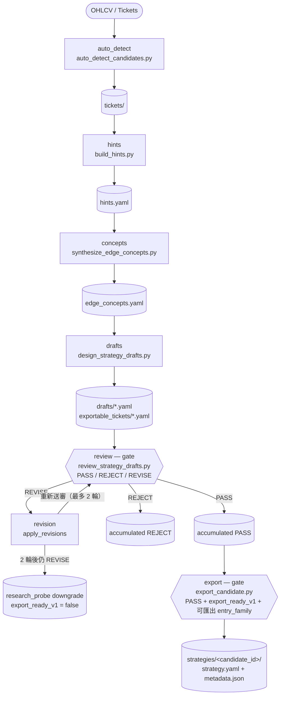

# 5.4 整條管線自動化

## 場景

5.1 到 5.3 走的是三段各自獨立的指令：先跑 `auto_detect_candidates.py`、`build_hints.py`，再跑 `synthesize_edge_concepts.py`、`design_strategy_drafts.py`，最後跑 `review_strategy_drafts.py`——碰上 `REVISE`，還得手動改完草稿再送審一次。`edge-pipeline-orchestrator` 把這串接力收進一支指令：`orchestrate_edge_pipeline.py --tickets-dir path/to/tickets/ --output-dir reports/edge_pipeline/`。`--output-dir` 底下長出一整棵樹——`pipeline_run_manifest.json` 記完整執行紀錄；若改用 `--from-ohlcv path/to/ohlcv.csv` 從原始 OHLCV 起跑，`tickets/` 這一層由 `auto_detect` 階段現生；往下依序是 `hints/hints.yaml`、`concepts/edge_concepts.yaml`、`drafts/*.yaml`、`exportable_tickets/*.yaml`、`reviews_iter_0/*.yaml`；一旦有草稿進了修正迴圈，還會多出 `reviews_iter_1/*.yaml`；終點是 `strategies/<candidate_id>/` 底下各自的 `strategy.yaml` 與 `metadata.json`。不必每次都從頭跑——`--resume-from drafts --drafts-dir path/to/drafts/` 直接從草稿階段接手，跳過偵測、hints、concepts 三站；`--review-only --drafts-dir path/to/drafts/` 更窄，只跑審查—修正這一段；`--dry-run` 的效果，CLI 的說明寫得直白：「Run pipeline without export stage」，其餘階段照跑，只是不落地成策略。

## 方法論

把三章併進同一次執行，改變的不只是操作方式，是判決怎麼被記帳。`revision_loop_rules.md` 訂的是累加制：`PASS` 與 `REJECT` 名單只進不出——`iter_0` 判成 `PASS` 的草稿，就算 `iter_1` 真的跑起來也不會被重新送審；`iter_0` 判成 `REJECT` 的草稿同樣不會再被碰。唯一流向下一輪的只有 `REVISE`。修正本身也是規則驅動：`apply_revisions` 認得三種指示——「Reduce entry conditions」對應只留前五條進場條件，「Add volume filter」對應在條件裡補上 `avg_volume > 500000`，「Round precise thresholds」對應把條件裡的小數門檻四捨五入成整數；修完之後 `variant` 與 `export_ready_v1` 原樣不動，等下一輪重新判。這個迴圈的上限，`orchestrate_edge_pipeline.py` 寫死在常數 `MAX_REVIEW_ITERATIONS = 2`；`--max-review-iterations` 只是把這個預設值開放成可調參數。

兩輪都過不了的 `REVISE` 草稿，走的是一條寫死的退路：`downgrade_to_research_probe` 把 `variant` 改寫成 `research_probe`，`export_ready_v1` 同步撥成 `false`，`draft_id` 記進一份 downgraded 清單——這不是淘汰，是把它從「等著被匯出的候選」改記成「等著被回頭研究的線索」，仍然留在輸出目錄裡，只是不再往匯出那一步走。

`auto_detect` 只讀 EOD OHLCV 找統計異常，管線之外另有一條路持續在累積類似的原料。`stockbee-20pct-study` 是獨立運行的每日 `+20%`／`-20%` 事件研究，`methodology.md` 把它的任務寫成三個問題：今天有哪些股票至少動了 20%、當時的催化劑與圖表背景是什麼、1、3、5、10、20 個交易日後發生了什麼；外加一條明講的 Operating Principle——「A 20% mover is an event, not a signal」。每一筆記錄都要先過催化劑分類，`catalyst_taxonomy.md` 列了十一種標籤——財報重估、法說調升、併購、FDA 臨床、合約訂單、分析師調升、軋空、主題連動、資本結構事件、低流通投機，一路到查無明確消息的 `NO_CLEAR_NEWS`；分類規則寫明優先採信結構化消息來源，寧可標成 `NO_CLEAR_NEWS`，也不要憑空編一個催化劑。`skills-index.yaml` 把整體立場寫進正式描述：這項研究「without treating movers as buy/sell signals」；對應的 workflow 檔在 `when_not_to_run` 補了同一句禁令——不得當成買賣訊號工作流，也不得從小樣本或未做生存者偏誤註記的資料直接晉升規則。它給的是持續產生的觀察材料，不是現成的訊號。

## 機制

`pipeline_flow.md` 把六個階段各自對到一支腳本：`auto_detect` 對 `edge-candidate-agent` 的 `auto_detect_candidates.py`，`hints` 對 `edge-hint-extractor` 的 `build_hints.py`，`concepts` 對 `edge-concept-synthesizer` 的 `synthesize_edge_concepts.py`，`drafts` 對 `edge-strategy-designer` 的 `design_strategy_drafts.py`，`review` 對 `edge-strategy-reviewer` 的 `review_strategy_drafts.py`，`export` 則繞回 `edge-candidate-agent`，用的是同一個 skill 的 `export_candidate.py`——管線的頭尾共用同一個 skill，只是呼叫了不同腳本。匯出資格卡三個條件同時成立：判決是 `PASS`；`export_ready_v1` 為 `true`；`entry_family` 落在可匯出家族之內。這裡認的名單跟 5.1 的 ticket 匯出表、5.3 的 C7 準則同一份程式碼常數——`DEFAULT_EXPORTABLE_FAMILIES` 實際是四個值：`pivot_breakout`、`gap_up_continuation`、`panic_reversal`、`news_reaction`（文件面的 `pipeline_flow.md` 與 `review_criteria.md` 仍只列前兩個），其餘一律留在研究這一側。匯出用的 ticket 也分兩種來源：優先用 `edge-strategy-designer` 靠 `--exportable-tickets-dir` 預先寫好的那一份；沒有預生成 ticket（多半是因為草稿改過）的，才由 `build_export_ticket()` 現場從草稿資料組一份，接口統一是 `export_candidate.py --ticket PATH --strategies-dir DIR`。另外兩個旗標只在跑全流程時有效：`--llm-ideas-file`、`--promote-hints` 一旦搭配 `--resume-from drafts` 或 `--review-only` 就會被忽略，因為這兩種模式本來就跳過了 hints、concepts 兩站；`--strict-export` 則反過來多開一道關卡：本來滿足匯出三條件、卻還背著哪怕一條 `warn` 的草稿，這個旗標會把它多打一折，改判 `REVISE`，不放行成 `PASS`。

`edge-signal-aggregator` 算的是另一套加權去重，跟 concepts 階段的機制不共用一套邏輯。預設權重六項合計 1.00：`edge-candidate-agent` 0.25、`edge-concept-synthesizer` 0.20、`theme-detector`／`sector-analyst`／`institutional-flow-tracker` 各 0.15、`edge-hint-extractor` 0.10；複合信心分數的算法是 `base_score = Σ(權重 × 正規化分數) / Σ(權重)`，再疊上共識加成（2 個 skill 一致 +0.10，3 個以上 +0.20）與合併加成（每合併一筆重複訊號 +0.05），最後乘上時效係數（24 小時內 ×1.00，逐段衰減到 7 天以上 ×0.85），封頂在 1.0。去重判定用的是方向相符，再加上 OR 邏輯的兩個條件之一：股票代碼 Jaccard 重疊 ≥30%，或標題字詞 Jaccard 相似度 ≥60%——任一成立即算重複，合併時保留原始分數最高的那一筆為主訊號。

## 判讀與誤用

`stockbee-20pct-study` 的產出容易被讀成「自動餵進管線」，但 `cohort_mining_rules.md` 的 Promotion Path 把中間那道手續寫得很清楚，五步缺一不可：`stockbee-20pct-study` 先產出一個 rule candidate；人工複核圖表與資料品質註記；`edge-hint-extractor` 或 `edge-candidate-agent` 把它轉成一份明確的研究 ticket；`backtest-expert` 用符合現實的執行假設驗證這個假說；最後由 `monthly-performance-review` 決定接受、拒絕，或繼續觀察。它自己輸出的那份 `edge_hints_yaml`，骨架是 `schema_version`、`source_skill`、外加一個直接取自 `rule_candidates` 的 `edge_hints` 陣列，跟 `hints_schema.md` 定義的 `hints.yaml`（`title`、`observation` 起手的那個陣列）並不是同一套結構，不能省略中間那道轉換直接接進 `concepts` 階段。「持續餵管線」說的是提供研究素材的節奏，不是免經人工的自動管道。

去重的門檻也藏著三套彼此獨立的數字，容易被誤當成同一把尺：`edge-pipeline-orchestrator` 轉發給 `concepts` 階段的 `--overlap-threshold` 預設是 0.75；`edge-signal-aggregator` 判定重複用的則是股票代碼 30% 或標題相似度 60%，兩種算法比對的對象（進場條件的重疊度 vs. 代碼與標題的 Jaccard 相似度）完全不同，調高其中一個門檻，對另一邊的去重結果毫無影響。

`research_probe` 這個標籤本身也有兩種完全不同的出身。`edge-strategy-designer` 的 When to Use 講的是設計階段就主動產出的一種變體——`core`、`conservative`、`research-probe`（連字號）三選一，跟另外兩種變體同時誕生，代表的是「一開始就偏保守的候選」。而 `pipeline_flow.md` 與 `revision_loop_rules.md` 裡的 `research_probe`（底線）是審查兩輪都過不了之後，被動貼上的降級標記。同一個字面意思的標籤，一個是設計時的主動選擇，一個是審查後的被動結果，讀 `variant` 欄位時不能只看值不看它是怎麼走到這一步的。

## 延伸閱讀

- [`skills/edge-pipeline-orchestrator/SKILL.md`](https://github.com/tradermonty/claude-trading-skills/blob/main/skills/edge-pipeline-orchestrator/SKILL.md)
- [`skills/edge-pipeline-orchestrator/references/pipeline_flow.md`](https://github.com/tradermonty/claude-trading-skills/blob/main/skills/edge-pipeline-orchestrator/references/pipeline_flow.md)
- [`skills/edge-pipeline-orchestrator/references/revision_loop_rules.md`](https://github.com/tradermonty/claude-trading-skills/blob/main/skills/edge-pipeline-orchestrator/references/revision_loop_rules.md)
- [`skills/stockbee-20pct-study/SKILL.md`](https://github.com/tradermonty/claude-trading-skills/blob/main/skills/stockbee-20pct-study/SKILL.md)
- [`skills/stockbee-20pct-study/references/methodology.md`](https://github.com/tradermonty/claude-trading-skills/blob/main/skills/stockbee-20pct-study/references/methodology.md)
- [`skills/stockbee-20pct-study/references/catalyst_taxonomy.md`](https://github.com/tradermonty/claude-trading-skills/blob/main/skills/stockbee-20pct-study/references/catalyst_taxonomy.md)
- [`skills/edge-signal-aggregator/SKILL.md`](https://github.com/tradermonty/claude-trading-skills/blob/main/skills/edge-signal-aggregator/SKILL.md)
- [`skills/edge-signal-aggregator/references/signal-weighting-framework.md`](https://github.com/tradermonty/claude-trading-skills/blob/main/skills/edge-signal-aggregator/references/signal-weighting-framework.md)
