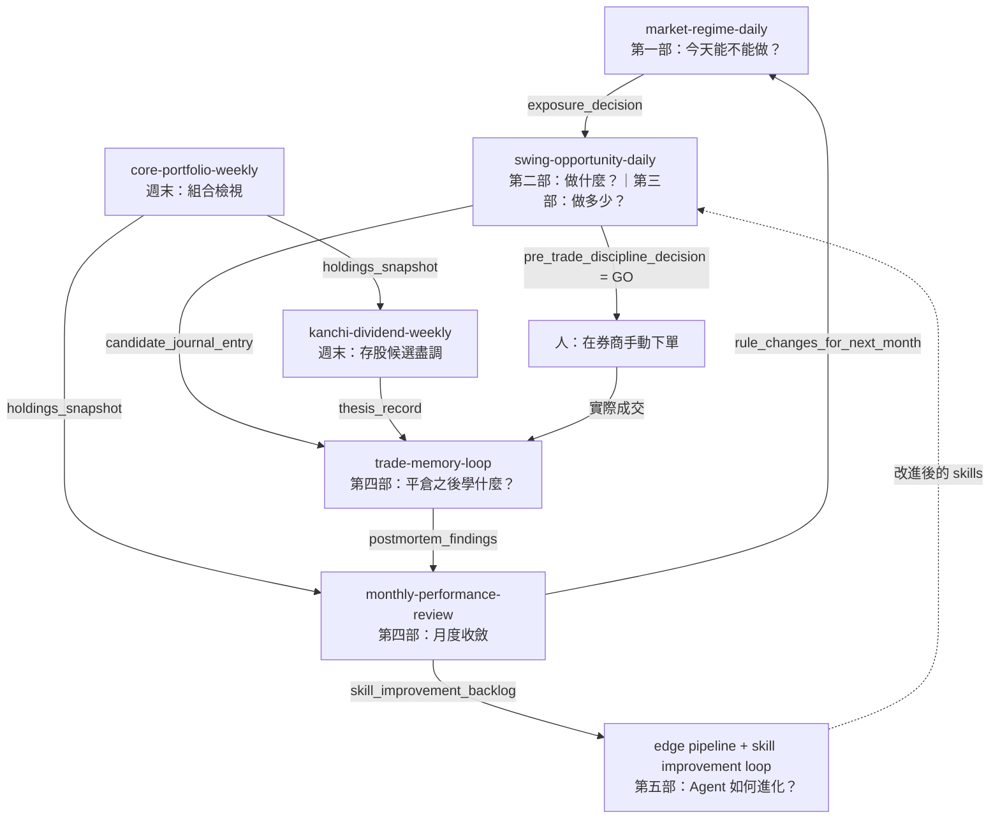

# 序章：一個 AI 交易 Agent 的一週

這個 Agent 沒有直覺，也沒有盤感。它擁有的只是一組 skills、幾條寫死順序的 workflow，以及一件更重要的東西：一批它自己繞不過去的閘門。

接下來這一章，跟著它走完一週。每一個時間點、每一個步驟、每一個檔案名稱，都能在上游 repo 的 `workflows/` 目錄裡找到對應的那幾行 YAML。這不是想像出來的行程表，是被版本控制管著的作業程序。

## 週一 06:30　先量體溫，再談機會

市場還沒開。Agent 醒來做的第一件事不是找股票——它連一張個股圖都還沒打開。

上游把這件事寫成一條叫 [`market-regime-daily`](https://github.com/tradermonty/claude-trading-skills/blob/main/workflows/market-regime-daily.yaml) 的 workflow：節奏 daily、預估 15 分鐘、`api_profile` 標的是 `no-api-basic`。翻成白話——這件每天都要做的事不花一毛 API 錢，十五分鐘做得完。它便宜到讓人沒有藉口跳過，而它問的又是一整天裡最大的那個問題：今天到底該不該冒風險。

四個步驟。

`market-breadth-analyzer` 先讀市場廣度，產出 `market_breadth_report`：到底有多少股票真的在漲，還是指數只是被幾檔權值股扛著。接著 `uptrend-analyzer` 量上升趨勢的參與度，產出 `uptrend_report`。第三步是可選的，`market-top-detector` 檢查頂部風險，產出 `top_risk_report`——跳過它流程照樣往下走，只是第四步會少一份證據。

第四步才是重點。`exposure-coach` 把前面三份報告一起吃進去，回答一個被 YAML 明文寫成 `decision_question` 的問題：以今天的廣度、上升趨勢參與度與頂部風險來看，新的波段交易風險該是 `allow`、`restrict`，還是 `cash-priority`？

整條 workflow 裡只有這一步的 `decision_gate` 標成 `true`。前三步不是閘門，它們是收集證據；第四步才是下判斷。輸出叫 `exposure_decision`，三選一。

然後 YAML 在 `when_not_to_run` 裡補了一句幾乎像是防身用的話：不要把這個輸出當成單獨的買賣訊號。`exposure_decision` 是**姿態**，不是指令。

這個區別是整本書的地基，值得說慢一點。姿態說的是「今天我願意讓多少風險上場」；訊號說的是「買這一檔」。`allow` 不等於買，它只是把後面那扇門解鎖。反過來，`restrict` 或 `cash-priority` 的後果同樣具體——`manual_review` 清單的最後一條寫著：姿態偏限制時，把 `swing-opportunity-daily` 往後延。

於是這一天有兩種可能的形狀。姿態允許，Agent 繼續往下走。姿態不允許，這一天的工作在 06:45 就結束了，而那也算一個完整的工作日。願意讓「什麼都不做」成為一個合法結局，是這套系統跟大多數選股工具最不一樣的地方。

## 07:30　姿態允許，才開始找標的

假設今天是 `allow`。

[`swing-opportunity-daily`](https://github.com/tradermonty/claude-trading-skills/blob/main/workflows/swing-opportunity-daily.yaml) 接手，預估 40 分鐘，`api_profile` 是 `fmp-required`——這條開始要花錢了。它的 `when_to_run` 只有一句：只有在 `market-regime-daily` 產出非限制性的 exposure 判斷之後才執行。

有意思的是它在實作上的誠實。這條 workflow 的 `prerequisite_workflows` 區塊指名了 `market-regime-daily` 與它的 `exposure_decision`，但區塊上方掛著一行註解，說明驗證器並不強制 workflow 之間的先後順序。換句話說，這條前置關係是寫給人看的紀律，不是程式攔得住的東西。系統知道自己攔不住你，所以它把規則寫在你一定看得見的地方。

第一步不是篩股，是 `drawdown-circuit-breaker`，產出 `circuit_breaker_decision`，而且同樣是 `decision_gate: true`。它問的問題跟 regime 那一關完全不同：市場准不准是一回事，你的帳戶准不准是另一回事。回撤太深、連續受傷，斷路器就不會回 `TRADING_ALLOWED`，後面十個步驟全部不必跑。`manual_review` 明確要求：在篩選或計算任何新候選**之前**，先確認斷路器是 `TRADING_ALLOWED`。順序不是排版問題，是設計。

過了斷路器，偵查工具才上場。`vcp-screener` 是唯一必跑的那一個，產出 `vcp_candidates`。接下來四個都可選，各自代表一種找股票的世界觀：`stockbee-momentum-burst-screener` 找動能爆發、`stockbee-exhaustion-hammer-screener` 找衰竭後的反手、`canslim-screener` 找成長股、`theme-detector` 做題材交叉比對，分別產出 `momentum_burst_candidates`、`exhaustion_hammer_candidates`、`canslim_candidates` 與 `theme_candidates`。全部加起來，桌上可能攤著幾十檔。

而 YAML 對這幾十檔的態度非常冷淡。`manual_review` 裡有兩條分別針對 Stockbee 的兩個 screener，開頭一模一樣：把輸出當成候選生成，僅此而已。screener 不是判斷，是原料。

第七步負責把原料變成判斷。`technical-analyst` 消化前面所有候選名單，在週線圖上驗證，產出 `validated_setups`，`decision_gate: true`。它的 `decision_question` 問得很具體：哪些候選有乾淨的週線結構——Stage 2 上升趨勢、緊縮的 base，或 Stockbee 式從受控 base 展開的區間擴張——並且通過人工看圖這一關？至於衰竭反手那一類，還要額外確認回檔不是論點被打破造成的，而且到當日低點的風險距離可以接受。不過的，淘汰。

「即使 screener 通過，週線不明確就淘汰」——這句在 `manual_review` 裡是獨立的一條。這是整條流程裡最像人的一步，也是最容易被績效壓力侵蝕的一步。名單是機器產的，捨棄是人做的。

活下來的候選進入第八步，`position-sizer` 算部位，產出 `position_sizing`。第九步可選，`breakout-trade-planner` 把驗證過的結構與部位大小組成 `trade_plans`。

接著是一個順序上非常值得注意的安排。第十步 `trader-memory-core` 登記論點，產出 `candidate_journal_entry`，同樣是決策閘：為每一個活下來的候選寫下 entry、stop、target，確認每筆風險與 `position-sizer` 的輸出一致，確認組合的總風險量（portfolio heat）在預算之內。

注意這一步在下單**之前**。不是成交以後補一筆紀錄，而是先把論點寫下來，才有資格去下單。事後補寫的紀錄永遠會偏袒結果；事前寫下的論點，才有被證偽的可能。第四部整部都在談這件事，而它的起點就在這裡。

最後一步，`pre-trade-discipline-gate`，產出 `pre_trade_discipline_decision`。它吃進前面幾乎所有東西——`candidate_journal_entry`、`position_sizing`、`trade_plans`、`circuit_breaker_decision`——然後在人碰到券商介面之前再問一次：這個候選有沒有書面計畫、有沒有事先設好的停損、部位大小對不對、最近的虧損紀錄允不允許、市場 regime 支不支持、斷路器清不清楚？六項全過，才是 `GO`。

## 09:30　Agent 停在這裡

開盤了。而 Agent 的工作結束了。

`swing-opportunity-daily` 的 `manual_review` 最後一條沒有任何模糊空間：所有訂單都在券商手動輸入，不自動執行。

這不是技術限制。上游確實有能連上券商 API 的 skill——`portfolio-manager` 走的是 Alpaca——但它出現在週末的組合檢視流程裡，沒有被接到這條當日流程的末端。也就是說，「不自動下單」是選出來的，不是做不到。

Agent 交出去的是一份 `GO` 或一份 `NO-GO`，外加一整套可稽核的推導過程。剩下那件事之所以留給人，是因為它剛好是不可外包的那一件：承擔後果的人，必須是按下按鈕的那一個。

## 收盤後　把今天寫回帳本

盤中發生了什麼——成交、沒成交、追價了、停損被掃、或是計畫好卻臨陣退縮——都要回寫。

六條 workflow 的最後一行都是同一句：`journal_destination: trader-memory-core`。市場檢查是它、盤前篩選是它、組合檢視是它、存股選股是它、平倉檢討是它、月度總結還是它。這套系統只有一本帳。

單一帳本這個決定不起眼，卻是後面所有事情的前提。論點、部位、平倉結果、事後檢討、下個月的規則變更全部沉澱在同一處，月底才攤得開來比對。分散在五個工具裡的紀錄，等於沒有紀錄。

## 週六上午　另一套節奏

週末的節奏跟平日完全不同，而且刻意不同。

[`core-portfolio-weekly`](https://github.com/tradermonty/claude-trading-skills/blob/main/workflows/core-portfolio-weekly.yaml) 預估 60 分鐘，一週一次，通常在週六或週日、下週開盤之前。它的 `when_not_to_run` 只講一件事：不要拿它當日常。每天翻動組合，就毀掉了這條流程賴以成立的長期前提。

`portfolio-manager` 先取 `holdings_snapshot`，再檢視配置與集中度產出 `allocation_report`——這是第一道決策閘，問的是產業與個股集中度有沒有落在目標區間，沒有的話具體怎麼調。第三步可選，`kanchi-dividend-review-monitor` 跑一輪 T1–T5 異常檢查，產出 `dividend_review_findings`。第四步是第二道閘門，把前兩者收斂成 `rebalance_actions`：下週到底要買什麼、賣什麼、放著不動什麼，含部位大小。最後 `trader-memory-core` 寫下 `weekly_journal_entry`。

`manual_review` 有三條，每一條都是把系統拉回現實的手：快照要對得上真實券商狀態；再平衡的單一樣在券商手動輸入；如果 T1–T5 亮了旗標，先暫停那檔的加碼，直到問題解決。

另一條週末流程是 [`kanchi-dividend-weekly`](https://github.com/tradermonty/claude-trading-skills/blob/main/workflows/kanchi-dividend-weekly.yaml)，它跟前一條的分工被寫得毫不含糊：維護既有持股是 `core-portfolio-weekly` 的事，這一條專門負責找**新的**候選並替它做盡職調查。

核心是第三步的 `kanchi-dividend-sop`，五步精查，決策閘。判定只有兩種命運：`CLEAN-PASS`、`PASS-CAUTION`、`CONDITIONAL-PASS` 可以往下走；`HOLD-REVIEW`、`STEP1-RECHECK`、`FAIL` 則是 fail-closed——就地停住，不進部位計算，也不進論點登記。

即使一路過關，最後一步也守得很緊。第六步 `trader-memory-core` 登記 `thesis_record`，`decision_question` 裡寫著：在券商真正成交之前，論點不得轉為 `ACTIVE`，這一步最多只能到 `IDEA` 或 `ENTRY_READY`。

這句話值得記住。一份寫得再漂亮的分析也不會讓狀態機相信你已經進場——只有真實成交才會。系統拒絕替使用者美化現實，這是它最值得信任的性格。

## 平倉的那一天

某個星期三下午，一檔部位平掉了。可能是停損被打到，可能是目標達成，也可能只是計畫改了。

[`trade-memory-loop`](https://github.com/tradermonty/claude-trading-skills/blob/main/workflows/trade-memory-loop.yaml) 的節奏是 `ad-hoc`：每一次平倉都跑，全部平倉或部分平倉都算。而 `when_not_to_run` 特別堵死了那條最誘人的岔路——就算是賺錢的單，也不准跳過這個迴圈。

`trader-memory-core` 先把結果落成 `closed_thesis_record`。接著 `signal-postmortem` 產出 `postmortem_findings`，這是一道決策閘，而且問題只有一個：這個結果的根本原因，是論點品質、是執行、是市場環境，還是隨機性？分類，然後記下來。

隨機性被列為四個正式選項之一，這件事本身就是一種姿態。承認有些賺賠不歸功於任何人，是誠實檢討的前提。`manual_review` 三條講的都是同一件事：贏了要老實承認是論點還是運氣；輸了要老實承認是論點有洞還是手忙腳亂；不要把隨機性包裝成技術或失敗。

後面兩步是可選的。`trade-performance-coach` 產出 `performance_coach_report` 與 `next_session_operating_rules`，同樣是決策閘——下一個交易時段的操作規則，哪些採用、哪些修改、哪些保留、哪些只記錄不執行。`backtest-expert` 則回頭重驗原本的假說，產出 `backtest_validation`。最後 `trader-memory-core` 把學到的東西追加成 `lessons_log_entry`。

一次平倉，一次歸檔，一次分類。單看沒什麼；累積三個月就變成資料。

## 月初第一個週末　把一個月變成規則

[`monthly-performance-review`](https://github.com/tradermonty/claude-trading-skills/blob/main/workflows/monthly-performance-review.yaml) 預估 90 分鐘，一個月一次。它的 `when_to_run` 直接寫明自己的角色：閉合「計畫 → 交易 → 記錄 → 檢討 → 改進」這個迴圈。而 `when_not_to_run` 同樣不留餘地——虧損的月份更不能跳過，因為那正是它最有價值的時候；也不要改成每週跑，月度節奏是為了濾掉雜訊而刻意選的。

`trader-memory-core` 先把整個月的交易與論點聚合成 `monthly_aggregate`。`signal-postmortem` 接著做的不是單筆檢討，而是模式層級的檢討，產出 `aggregate_postmortem`：這個月反覆出現的形態是什麼？一樣按論點品質、執行、市場環境、隨機性四類歸檔。

可選步驟裡藏著整本書最有趣的一步：`dual-axis-skill-reviewer` 產出 `skill_review_findings`——檢討的對象不是交易，是工具本身。這個月哪些 skill 幫上了忙，哪些幫了倒忙。

最後一步收斂成三份輸出，而它們被刻意分開放：`monthly_decision_log`（哪些交易有效、哪些無效，按類別整理）、`rule_changes_for_next_month`（部位計算、進場規則、regime 閘門的調整），以及可選的 `skill_improvement_backlog`（回饋給 repo 改進迴圈的 skills 與 workflows 清單）。

交易側的改進與工具側的改進不混在一起——這是一個很成熟的區分。前者改的是人下個月的行為，後者改的是程式碼。而 `manual_review` 補了一句最少人願意做的事：要願意刪掉或降級不管用的規則，而不是只會一直加新的。

## 研究日　Agent 回頭改自己

`skill_improvement_backlog` 是整套系統裡唯一一條從交易迴圈通往工具本身的線。

順著它走下去，就是第五部的地界。這份清單被宣告的收件人只有一個：一組每天自動替 skills 評分、改進並開 PR 的迴圈——改的正是這本書從頭到尾在描述的那些工具。而第五部同一塊地界上還並排著另一條線：從觀察與異常出發，抽出假說，合成 edge 概念，寫成策略草稿，再送進審查與否證——過了才輸出，沒過就打回修，改兩輪還不行就結案；整條管線可以由 `edge-pipeline-orchestrator` 一口氣跑完。

換句話說，這本書描述的 Agent，正在每天自動改進這本書描述的工具。細節留給第五部；序章只需要你記得這條線存在——它是這一週的迴圈真正閉合的地方。

## 器官、神經與反射

走完一週，可以回頭看整個結構了。

**Skills 是器官。** 每一個各司其職，邊界清楚：`market-breadth-analyzer` 只管廣度，`position-sizer` 只管把風險換算成股數，`signal-postmortem` 只管歸因。器官不互相取代，也不越權；`vcp-screener` 從頭到尾不會知道你的帳戶還剩多少錢。

**Workflows 是神經系統。** 器官本身不會排序，是 workflow 決定訊號的流向：`exposure_decision` 先到，`circuit_breaker_decision` 其次，週線驗證再其次，紀律閘門最後。artifact 就是在神經之間傳遞的訊號，`downstream_hints` 則標明它下一站要送去哪裡。抽掉 workflow，71 個 skills 就只是一抽屜零件。

**Fail-closed gates 是本能反射。** 反射的特徵是不經過思考，也不容許商量：斷路器不是 `TRADING_ALLOWED` 就不往下走；Kanchi 判定落在 `HOLD-REVIEW`、`STEP1-RECHECK` 或 `FAIL` 就地停住；`pre_trade_discipline_decision` 不是 `GO` 就不下單。反射的價值不在它多聰明，而在它不會被當下的情緒說服。人在盤中最想繞過的，恰好就是這幾道。

而在這副身體之外，還有一個不能被取代的角色。所有 workflow 都有 `manual_review` 清單，所有訂單都由人手動輸入。Agent 負責讓判斷變得可稽核、可重複、可推翻；人負責承擔後果。這個分工不是妥協，是設計的核心——第三部會整章談它。

## 一週的形狀

圖上的實線有三種出身。多數來自 YAML 宣告式的 artifact 接線：`exposure_decision` 的 `downstream_hints` 指向 `swing-opportunity-daily`，`candidate_journal_entry` 與 `thesis_record` 指向 `trade-memory-loop`，`postmortem_findings` 與 `holdings_snapshot` 指向 `monthly-performance-review`。`core-portfolio-weekly` 到 `kanchi-dividend-weekly` 那條邊也是宣告式的，但出處不同：`holdings_snapshot` 自己的 `downstream_hints` 只點名 `monthly-performance-review`，這條邊靠的是消費端——`kanchi-dividend-weekly.yaml` 開頭的 `prerequisite_workflows`，指名 `core-portfolio-weekly` 與它的 `holdings_snapshot`，供步驟 4、5 的稅務與監控檢查選用。另外四條沒有這種宣告可依：`GO` 之後交到人手上、實際成交之後才啟動平倉檢討，只寫在 `manual_review` 與 `when_to_run` 的散文裡；月度那兩條回饋線——規則變更回到 regime 閘門、`skill_improvement_backlog` 流向工具本身——也只有 `final_outputs` 的文字描述支撐。接縫是真的，但有幾道是用句子縫的，不是用欄位。虛線那條則純粹是第五部的預告。

從這裡開始，五部各自把上圖的一個節點拆開來看。第一部先回到週一早上六點半，回答那個最基本、也最常被跳過的問題：今天到底能不能做？

一句必要的話收尾：這本書談的是決策流程怎麼設計，不是該買什麼。裡面所有工具的輸出都是姿態不是訊號，所有訂單都由人手動執行，全書不構成投資建議。
